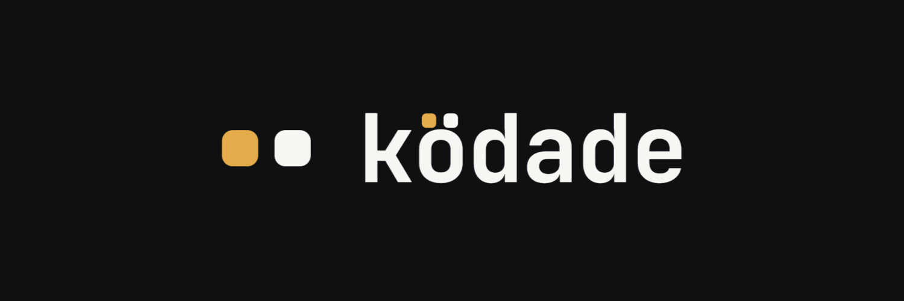

<p align="center">
  
</p>

<p align="center">
  A native workspace for projects, terminals, files, and the agent CLIs you
  already use.
</p>

<p align="center">
  <a href="https://kodade.com">Website</a> ·
  <a href="https://github.com/Kodade/kodade/releases">Releases</a> ·
  <a href="ROADMAP.md">Roadmap</a> ·
  <a href="CONTRIBUTING.md">Contributing</a>
</p>

## Status

Ködade 1.4.14 is the current public macOS Apple Silicon release. It is
Developer ID signed, Apple-notarized, and Gatekeeper-verified. Download it from
the [Releases page](https://github.com/Kodade/kodade/releases/tag/v1.4.14).

The supported package targets **Apple Silicon Macs running macOS 13 or newer**.
Windows support is under active development; Linux is planned.

## What Ködade does

- **KödChat** provides a chat-first interface for Claude Code, Codex, Grok
  Build, and OpenCode through their official CLIs, with compact work summaries,
  inline edited-file review, and a resizable terminal split owned by the
  current thread. OpenCode uses its official JSON run mode: Plan maps to its
  `plan` agent, Standard to `build`, and Full uses OpenCode's `--auto` behavior
  without changing its configuration. Its model picker reads the current
  project's available catalog reported by the installed CLI through
  `opencode models`, keeps a Default choice, and never ships a guessed model
  list. Remote OpenCode chats remain Default-only because model catalogs are
  host-specific.
- **Ollama** is a local HTTP chat provider at `127.0.0.1:11434`: KödChat lists
  the models Ollama has installed and streams chat through its OpenAI-compatible
  endpoint. It is chat-only — it cannot read project files, call tools, or use
  a server-side conversation session. History is persisted and replayed on the
  client within the active provider/model conversation; switching either keeps
  the visible transcript but starts fresh history. Its provider-neutral HTTP
  transport is independent of the in-development KödLocal product surface.
- **Real terminals** use your login shell, PATH, authentication, configuration,
  and provider subscriptions.
- **Projects, files, and editor** keep code visible beside agent sessions.
- **KödMem and KödMCP** preserve local project context in readable files and a
  searchable local index.
- **KödHarness and KödSkills** make agent instructions and skills inspectable.
- **Browser and GitHub panes** keep previews, assistant links, and repository
  context in editor tabs without replacing the desktop workspace.

Ködade does not proxy model traffic, hold provider credentials, or bill for
tokens. You install and authenticate the agent CLIs you want to use; for
Ollama, install/start the local service and pull a model yourself.

## Development features

The source contains active development work for KödLocal, KödWhisper, KödSSH,
Remote, and Windows. These surfaces remain absent from public release builds
until they are ready to support. See [ROADMAP.md](ROADMAP.md).

Ködade is a native desktop application. A hosted browser application is not
part of this repository or the current product.

## Build from source

Prerequisites: Node.js 24+, pnpm 11+, Rust stable, and platform tools required
by Tauri. On macOS, install Xcode Command Line Tools.

```bash
git clone https://github.com/Kodade/kodade.git
cd kodade
pnpm install --frozen-lockfile
pnpm tauri dev
```

Useful checks:

```bash
pnpm check:version
pnpm typecheck
pnpm test
pnpm test:public
pnpm build:public
pnpm verify:public-source
```

`pnpm tauri build` creates a full-feature development/QA package.
`pnpm tauri:build:public` is the public-release build and excludes unfinished
feature surfaces and payloads.

## Architecture

Ködade is a [Tauri 2](https://tauri.app/) application with a React/TypeScript
frontend and a focused Rust platform layer. Rust owns PTYs, filesystem/process
boundaries, and native integration; product behavior stays in TypeScript. The
editor uses CodeMirror 6 and terminals use xterm.js over `portable-pty`.

## Contributing and security

Start with [CONTRIBUTING.md](CONTRIBUTING.md). Contributions use the
[Developer Certificate of Origin](DCO), so every commit must include a
`Signed-off-by` line.

Report vulnerabilities privately using [SECURITY.md](SECURITY.md), not a
public issue. Community participation is governed by the
[Code of Conduct](CODE_OF_CONDUCT.md).

## License and trademarks

Ködade is licensed under the [Apache License 2.0](LICENSE). Third-party
components retain their own licenses; see
[THIRD_PARTY_NOTICES.md](THIRD_PARTY_NOTICES.md).

The Apache license does not grant rights to the Ködade name or logos. See
[TRADEMARK.md](TRADEMARK.md). Ködade is independent and is not affiliated with
or endorsed by Anthropic, OpenAI, xAI, OpenCode, or their products.
